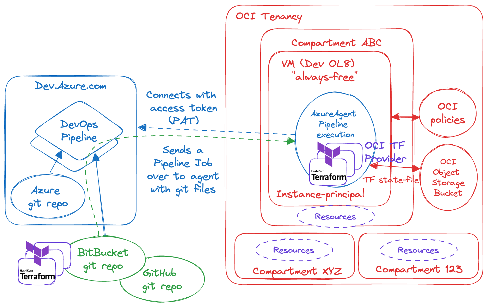

## Running Terraform from Azure DevOps with OCI runner (Azure DevOps agent)

Terraform files are store in git repo on Azure side and passed over to agent within the pipeline execution.

Terraform files are run as <b><i>instance-principal</i></b> on OCI and hence terraform execution is authorized using OCI policies.
    

No OCI credentials are stored on Azure side. Only the PAT is need for the OCI runner (Azure DevOps agent) to connect to Azure Dev and start listening for pipeline jobs.

Terraform state is stored on OCI Object Storage private Bucket.

The following resources are created within the example terraform files:
<ul>
    <li>VCN</li>
    <li>Compute VM with ssh access</li>
    <li>Database (ATP)</li>
</ul>

    

